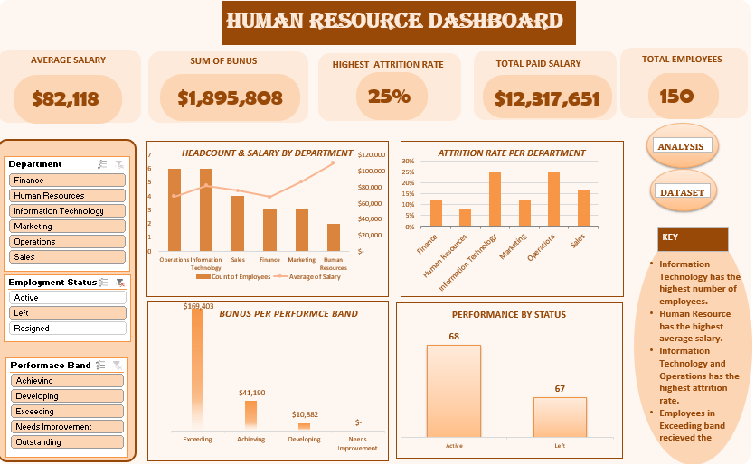
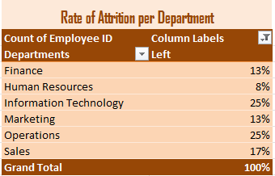
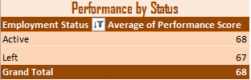
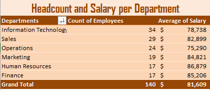
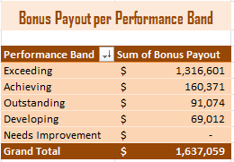
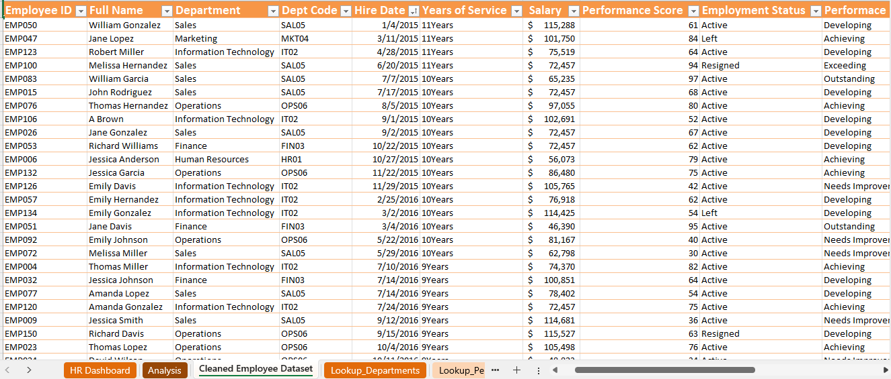

# HR Data Analytics Capstone Project
## Project Overview
This project focuses on cleaning, transforming, analyzing, and visualizing an HR employee dataset using Microsoft Excel, Power Query, Pivot Tables, and an interactive dashboard. The goal was to improve the quality of the dataset, perform exploratory data analysis, and present meaningful insights that support data-driven HR decision-making.
---
# Initial Dataset Assessment
After exploring the dataset, I observed the following data quality issues:
- Duplicate employee records.
- Missing values in the First Name, Salary, and Performance Score columns.
- Inconsistent text formatting across some columns.
- Department codes that needed to be mapped to department names.
- Incorrect data types in the Hire Date, Salary, and Performance Score columns.
- Inconsistent values in the Employment Status column (e.g., **"actv"** instead of **"Active"**).
These issues were addressed before proceeding with the analysis.
---
# Data Cleaning Process
The dataset was cleaned in the following order:
## Step 1: Convert the Dataset into an Excel Table
- Converted the raw dataset into an Excel Table.
- Activated filters for easier navigation and data management.
## Step 2: Load Data into Power Query
- Imported the dataset into the Power Query Editor for cleaning and transformation.
## Step 3: Remove Duplicate Records
- Removed duplicate records using the **Employee ID** column to ensure that each employee appeared only once.
## Step 4: Handle Missing Values
### First Name
- Replaced blank cells with **"A"**.
### Salary
- Changed the data type to **Currency**.
- Replaced approximately **13%** of missing salary values with the **mean salary (72,457)**.
### Performance Score
- Renamed **Perf-Score** to **Performance Score**.
- Changed the data type to **Whole Number**.
- Filled down approximately **6%** of missing values.
## Step 5: Standardize Text Values
### Department Code
- Converted text to **UPPERCASE**.
- Applied **Trim** to remove extra spaces.
- Applied **Clean** to remove non-printable characters.
### Employment Status
- Replaced **"actv"** with **"Active"**.
- Applied **Capitalize Each Word**.
- Applied **Trim** and **Clean** for consistency.
## Step 6: Correct Data Types
The following data types were assigned:
- Hire Date → Date
- Salary → Currency
- Performance Score → Whole Number
## Step 7: Sort the Dataset
- Sorted the cleaned dataset by the **Hire Date** column.
---
# Data Transformation
The following calculated columns were created to enrich the dataset:
### Full Name
Merged the **First Name** and **Last Name** columns using a space separator.
### Department Name
Used **VLOOKUP** to retrieve the full department name based on the Department Code.
### Years of Service
Calculated using the **DATEDIF** function to determine the number of years each employee has worked in the organization.
### Performance Band
Used the **IFS** function to classify employees into the following categories based on their performance score:
- Outstanding
- Exceeding
- Achieving
- Developing
- Needs Improvement
### Bonus Percentage
Assigned bonus percentages to each employee based on their Performance Band using the **IFS** function.
### Bonus Payout
Calculated by multiplying the employee's salary by the assigned bonus percentage.
### Actual Pay
Calculated by adding the employee's salary and bonus payout.
---
# Assumptions and Cleaning Decisions
During the cleaning process, several decisions were made to ensure the dataset remained meaningful and suitable for analysis.
- Blank salary values were not replaced with zero because employees cannot realistically earn a salary of zero.
- Using the midpoint between the highest and lowest salary was considered but rejected because it could misrepresent the missing values if the salary distribution was skewed.
- The **mean salary (72,457)** was therefore used to replace missing salary values as it provided a more representative estimate.
- Blank first names were replaced with **"A"** to eliminate missing text values while preserving the records.
---
# Challenges Encountered and Solutions
## Challenge 1: Handling Missing Salary Values
One of the biggest challenges was deciding how to handle missing salary values.
Initially, I considered replacing the missing values with zero, but this was unrealistic because employees cannot earn a salary of zero.
I then considered using the midpoint between the highest and lowest salaries. However, I realized that this approach might not accurately represent the missing values because of the skewness of the salary distribution.
After evaluating the available options, I decided to replace the missing values with the **mean salary (72,457)** because it provided a more representative estimate.
## Challenge 2: Accidental Deletion of the Raw Dataset
While cleaning the dataset, I accidentally deleted the worksheet containing the raw data because I believed it would no longer be needed.
Later, while preparing documentation for the project, Power Query returned the following error:
> **Expression.Error: The table 'Table1' wasn't found.**
After researching the issue, I learned that Power Query was still connected to the deleted source table.
To resolve the problem, I:
- Downloaded the dataset again.
- Copied the raw data worksheet into my cleaned workbook.
- Converted it into an Excel Table.
- Refreshed the Power Query connection.
This restored the source data and all previously applied transformation steps.
---
# Dashboard Preview
The final dashboard provides an interactive overview of key HR metrics using KPI cards, charts, and slicers.

---
# Pivot Tables
The following Pivot Tables were created to answer the business questions and support the dashboard:
- Headcount and Average Salary by Department
- Attrition Rate by Department
- Performance Score by Employment Status
- Bonus Payout by Performance Band

---
# Cleaned Dataset
The cleaned dataset contains standardized data, corrected data types, handled missing values, removed duplicates, and all calculated columns created during the transformation stage.

---
# Key Insights
The exploratory data analysis revealed the following insights:
- **Information Technology** has the highest number of employees.
- **Human Resources** has the highest average salary.
- **Information Technology and Operations** recorded the highest employee attrition rate.
- Employees in the **Exceeding** performance band received the highest total bonus payout.
These findings can help management understand workforce distribution, identify departments experiencing higher employee turnover, and evaluate employee compensation and reward strategies.
---
# Learning Outcome
This project was a transformative learning experience. It strengthened my practical skills in data cleaning, Power Query, Excel functions, Pivot Tables, and dashboard design. It also reinforced the importance of documenting every step of the data cleaning process, making informed decisions when handling missing values, and preserving raw data throughout the analysis.
---
# Conclusion
The HR dataset was successfully cleaned, transformed, analyzed, and visualized using Microsoft Excel, Power Query, Pivot Tables, and an interactive dashboard. Every cleaning step, assumption, transformation, challenge, and analytical insight has been documented to ensure that the entire process is transparent, reproducible, and easy to understand.